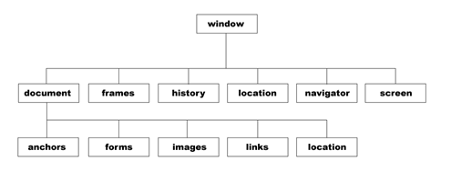

# BOM

BOM也叫浏览器对象模型，它提供了很多对象，用于访问浏览器的功能。BOM缺少规范，每个浏览器提供商又按照自己想法去扩展它，那么浏览器共有对象就成了事实的标准。所以，BOM本身是没有标准的或者还没有哪个组织去标准它。

一．window对象
BOM的核心对象是window，它表示浏览器的一个实例。window对象处于JavaScript结构的最顶层，对于每个打开的窗口，系统都会自动为其定义 window 对象。 

 

1.对象的属性和方法 
window对象有一系列的属性，这些属性本身也是对象。

window对象的属性
属性 	含义 
closed	当窗口关闭时为真 
defaultStatus	窗口底部状态栏显示的默认状态消息 
document	窗口中当前显示的文档对象 
frames	窗口中的框架对象数组 
history	保存有窗口最近加载的URL 
length	窗口中的框架数 
location	当前窗口的URL 
name	窗口名 
offscreenBuffering	用于绘制新窗口内容并在完成后复制已存在的内容，控制屏幕更新 
opener	打开当前窗口的窗口 
parent	指向包含另一个窗口的窗口（由框架使用） 
screen	显示屏幕相关信息，如高度、宽度（以像素为单位） 
self	指示当前窗口。 
status	描述由用户交互导致的状态栏的临时消息 
top	包含特定窗口的最顶层窗口（由框架使用） 
window	指示当前窗口，与self等效 

window对象的方法
方法	功能
alert(text)	创建一个警告对话框，显示一条信息
blur()	将焦点从窗口移除
clearInterval(interval)	清除之前设置的定时器间隔
clearTimeOut(timer)	清除之前设置的超时
close()	关闭窗口
confirm()	创建一个需要用户确认的对话框
focus()	将焦点移至窗口
open(url,name,[options])	打开一个新窗口并返回新window对象
prompt(text,defaultInput)	创建一个对话框要求用户输入信息
scroll(x,y)	在窗口中滚动到一个像素点的位置
setInterval(expression,milliseconds)	经过指定时间间隔计算一个表达式
setInterval(function,millisenconds,[arguments])	经过指定时间间隔后调用一个函数
setTimeout(expression,milliseconds)	在定时器超过后计算一个表达式
setTimeout(expression,milliseconds,[arguments])	在定时器超过时后计算一个函数
print()	调出打印对话框
find()	调出查找对话框

window下的属性和方法，可以使用window.属性、window.方法()或者直接属性、方法()的方式调用。例如：window.alert()和alert()是一个意思。

2.系统对话框
浏览器通过alert()、confirm()和prompt()方法可以调用系统对话框向用户显示信息。系统对话框与浏览器中显示的网页没有关系，也不包含HTML。

//弹出警告
alert('Lee');								//直接弹出警告

//确定和取消
confirm('请确定或者取消');					//这里按哪个都无效		
if (confirm('请确定或者取消')) {				//confirm本身有返回值
	alert('您按了确定！');					//按确定返回true
} else {
	alert('您按了取消！');					//按取消返回false
}

//输入提示框
var num = prompt('请输入一个数字', 0);		//两个参数，一个提示，一个值
alert(num);								//返回值可以得到

//调出打印及查找对话框
print();									//打印
find();									//查找

defaultStatus = '状态栏默认文本';				//浏览器底部状态栏初始默认值
status='状态栏文本';						//浏览器底部状态栏设置值

3.新建窗口
使用window.open()方法可以导航到一个特定的URL，也可以打开一个新的浏览器窗口。它可以接受四个参数：1.要加载的URL；2.窗口的名称或窗口目标；3.一个特性字符串；4.一个表示新页面是否取代浏览器记录中当前加载页面的布尔值。
open('http://www.baidu.com');				//新建页面并打开百度
open('http://www.baidu.com','baidu');			//新建页面并命名窗口并打开百度
open('http://www.baidu.com','_parent');			//在本页窗口打开百度,_blank是新建

PS：不命名会每次打开新窗口，命名的第一次打开新窗口，之后在这个窗口中加载。窗口目标是提供页面的打开的方式，比如本页面，还是新建。

第三字符串参数
设置	值	说明
width	数值	新窗口的宽度。不能小于100
height	数值	新窗口的高度。不能小于100
top	数值	新窗口的Y坐标。不能是负值
left	数值	新窗口的X坐标。不能是负值
location	yes或no	是否在浏览器窗口中显示地址栏。不同浏览器默认值不同
menubar	yes或no	是否在浏览器窗口显示菜单栏。默认为no
resizable	yes或no	是否可以通过拖动浏览器窗口的边框改变大小。默认为no
scrollbars	yes或no	如果内容在页面中显示不下，是否允许滚动。默认为no
status	yes或no	是否在浏览器窗口中显示状态栏。默认为no
toolbar	yes或no	是否在浏览器窗口中显示工具栏。默认为no
fullscreen	yes或no	浏览器窗口是否最大化，仅限IE

//第三参数字符串
open('http://www.baidu.com','baidu','width=400,height=400,top=200,left=200,toolbar=yes');

//open本身返回window对象
var box = open();
box.alert('');								//可以指定弹出的窗口执行alert();

//子窗口操作父窗口
document.onclick = function () {
	opener.document.write('子窗口让我输出的！');
}

3.窗口的位置和大小
用来确定和修改window对象位置的属性和方法有很多。IE、Safari、Opera和Chrome都提供了screenLeft和screenTop属性，分别用于表示窗口相对于屏幕左边和上边的位置。Firefox则在screenX和screenY属性中提供相同的窗口位置信息，Safari和Chrome也同时支持这两个属性。

//确定窗口的位置,IE支持
alert(screenLeft);							//IE支持
alert(typeof screenLeft);						//IE显示number，不支持的显示undefined

//确定窗口的位置,Firefox支持
alert(screenX);								//Firefox支持
alert(typeof screenX);						//Firefox显示number,不支持的同上

PS：screenX属性IE浏览器不认识，直接alert(screenX)，screenX会当作一个为声明的变量，导致不执行。那么必须将它将至为window属性才能显示为初始化变量应有的值，所以应该写成：alert(window.screenX)。

//跨浏览器的方法
var leftX = (typeof screenLeft == 'number') ? screenLeft : screenX;
var topY = (typeof screenTop == 'number') ? screenTop : screenY;

窗口页面大小，Firefox、Safari、Opera和Chrome均为此提供了4个属性：innerWidth和innerHeight，返回浏览器窗口本身的尺寸；outerWidth和outerHeight，返回浏览器窗口本身及边框的尺寸。

alert(innerWidth);							//页面长度
alert(innerHeight);							//页面高度
alert(outerWidth);							//页面长度+边框
alert(outerHeight);							//页面高度+边框

PS：在Chrome中，innerWidth=outerWidth、innerHeight=outerHeight；
PS：IE没有提供当前浏览器窗口尺寸的属性；不过，在后面的DOM课程中有提供相关的方法。

在IE以及Firefox、Safari、Opera和Chrome中，document.documentElement.clientWidth和document.documentElement.clientHeight中保存了页面窗口的信息。
PS：在IE6中，这些属性必须在标准模式下才有效；如果是怪异模式，就必须通过document.body.clientWidth和document.body.clientHeight取得相同的信息。

//如果是Firefox浏览器，直接使用innerWidth和innerHeight
var width = window.innerWidth;				//这里要加window，因为IE会无效
var height = window.innerHeight;

if (typeof width != 'number') {				//如果是IE，就使用document		
	if (document.compatMode == 'CSS1Compat') {
		width = document.documentElement.clientWidth;
		height = document.documentElement.clientHeight;
	} else {
		width = document.body.clientWidth;	//非标准模式使用body
		height = document.body.clientHeight;
	}
}

PS：以上方法可以通过不同浏览器取得各自的浏览器窗口页面可视部分的大小。document.compatMode可以确定页面是否处于标准模式，如果返回CSS1Compat即标准模式。

//调整浏览器位置
moveTo(0,0);								//IE有效，移动到0,0坐标
moveBy(10,10);							//IE有效，向下和右分别移动10像素

//调整浏览器大小
resizeTo(200,200);							//IE有效，调正大小
resizeBy(200,200);							//IE有效，扩展收缩大小

PS：由于此类方法被浏览器禁用较多，用处不大。

4.间歇调用和超时调用
JavaScript是单线程语言，但它允许通过设置超时值和间歇时间值来调度代码在特定的时刻执行。前者在指定的时间过后执行代码，而后者则是每隔指定的时间就执行一次代码。
超时调用需要使用window对象的setTimeout()方法，它接受两个参数：要执行的代码和毫秒数的超时时间。
setTimeout("alert('Lee')", 1000);				//不建议直接使用字符串

function box() {
	alert('Lee');
}
setTimeout(box, 1000);						//直接传入函数名即可

setTimeout(function () {						//推荐做法
	alert('Lee');
}, 1000);

PS：直接使用函数传入的方法，扩展性好，性能更佳。

调用setTimeout()之后，该方法会返回一个数值ID，表示超时调用。这个超时调用的ID是计划执行代码的唯一标识符，可以通过它来取消超时调用。
要取消尚未执行的超时调用计划，可以调用clearTimeout()方法并将相应的超时调用ID作为参数传递给它。
var box = setTimeout(function () {				//把超时调用的ID复制给box
	alert('Lee');
}, 1000);

clearTimeout(box);							//把ID传入，取消超时调用

间歇调用与超时调用类似，只不过它会按照指定的时间间隔重复执行代码，直至间歇调用被取消或者页面被卸载。设置间歇调用的方法是setInterval()，它接受的参数与setTimeout()相同：要执行的代码和每次执行之前需要等待的毫秒数。
setInterval(function () {						//重复不停执行
	alert('Lee');
}, 1000);

取消间歇调用方法和取消超时调用类似，使用clearInterval()方法。但取消间歇调用的重要性要远远高于取消超时调用，因为在不加干涉的情况下，间歇调用将会一直执行到页面关闭。
var box = setInterval(function () {				//获取间歇调用的ID
	alert('Lee');
}, 1000);

clearInterval(box);							//取消间歇调用

但上面的代码是没有意义的，我们需要一个能设置5秒的定时器，需要如下代码：
var num = 0;								//设置起始秒
var max = 5;								//设置最终秒

setInterval(function () {						//间歇调用
	num++;								//递增num
	if (num == max) {						//如果得到5秒
		clearInterval(this);					//取消间歇调用，this表示方法本身
		alert('5秒后弹窗！');			
	}	
}, 1000);									//1秒

一般认为，使用超时调用来模拟间歇调用是一种最佳模式。在开发环境下，很少使用真正的间歇调用，因为需要根据情况来取消ID，并且可能造成同步的一些问题，我们建议不使用间歇调用，而去使用超时调用。
var num = 0;
var max = 5;
function box() {
	num++;
	if (num == max) {
		alert('5秒后结束！');
	} else {
		setTimeout(box, 1000);
	}
}
setTimeout(box, 1000);						//执行定时器

PS：在使用超时调用时，没必要跟踪超时调用ID，因为每次执行代码之后，如果不再设置另一次超时调用，调用就会自行停止。

二．location对象
location是BOM对象之一，它提供了与当前窗口中加载的文档有关的信息，还提供了一些导航功能。事实上，location对象是window对象的属性，也是document对象的属性；所以window.location和document.location等效。

alert(location);								//获取当前的URL

location对象的属性
属性	描述的URL内容
hash	如果该部分存在，表示锚点部分
host	主机名：端口号
hostname	主机名
href	整个URL
pathname	路径名
port	端口号
protocol	协议部分
search	查询字符串

location对象的方法
方法	功能
assign()	跳转到指定页面，与href等效
reload()	重载当前URL
repalce()	用新的URL替换当前页面

location.hash = '#1';						//设置#后的字符串，并跳转
alert(location.hash);						//获取#后的字符串

location.port = 8888;						//设置端口号，并跳转
alert(location.port);							//获取当前端口号，

location.hostname = 'Lee';					//设置主机名，并跳转
alert(location.hostname);					//获取当前主机名，

location.pathname = 'Lee';					//设置当前路径，并跳转
alert(location.pathname);					//获取当前路径，

location.protocal = 'ftp:';						//设置协议，没有跳转
alert(location.protocol);						//获取当前协议

location.search = '?id=5';					//设置?后的字符串，并跳转
alert(location.search);						//获取?后的字符串

location.href = 'http://www.baidu.com';			//设置跳转的URL，并跳转
alert(location.href);							//获取当前的URL

在Web开发中，我们经常需要获取诸如?id=5&search=ok这种类型的URL的键值对，那么通过location，我们可以写一个函数，来一一获取。

function getArgs() {
//创建一个存放键值对的数组
	var args = [];				
//去除?号			
	var qs = location.search.length > 0 ? location.search.substring(1) : '';
//按&字符串拆分数组
	var items = qs.split('&');
	var item = null, name = null, value = null;
//遍历
	for (var i = 0; i < items.length; i++) {
		item = items[i].split('=');
		name = item[0];
		value = item[1];
//把键值对存放到数组中去
		args[name] = value;
	}
	return args;
}

var args = getArgs();
alert(args['id']);
alert(args['search']);

location.assign('http://www.baidu.com');		//跳转到指定的URL

location.reload();							//最有效的重新加载，有可能从缓存加载
location.reload(true);						//强制加载，从服务器源头重新加载

location.replace('http://www.baidu.com');		//可以避免产生跳转前的历史记录

三．history对象
history对象是window对象的属性，它保存着用户上网的记录，从窗口被打开的那一刻算起。
history对象的属性
属性	描述URL中的哪部分
length	history对象中的记录数

history对象的方法
方法	功能
back()	前往浏览器历史条目前一个URL，类似后退
forward()	前往浏览器历史条目下一个URL，类似前进
go(num)	浏览器在history对象中向前或向后

function back() {							//跳转到前一个URL
	history.back();	
}

function forward() {						//跳转到下一个URL
	history.forward();
}

function go(num) {							//跳转指定历史记录的URL
	history.go(num);
}

PS：可以通过判断history.length == 0，得到是否有历史记录。
